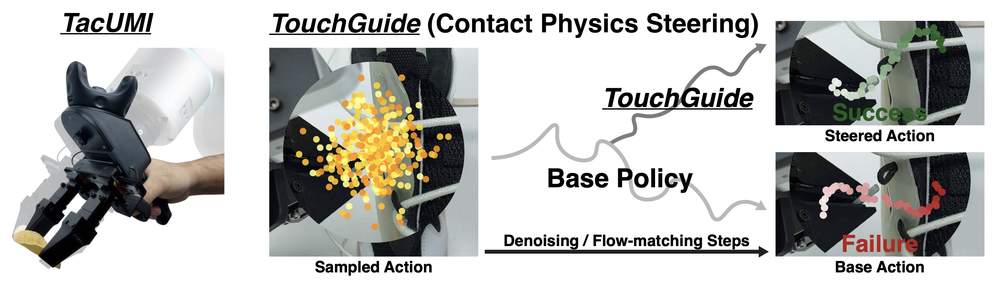

# TouchGuide: Inference-Time Steering of Visuomotor Policies via Touch Guidance



Project Page: [martelzhang.github.io/touchguide](https://martelzhang.github.io/touchguide)

Paper: [arxiv.org/pdf/2601.20239](https://arxiv.org/pdf/2601.20239)

Zhemeng Zhang, Jiahua Ma, Xincheng Yang, Xin Wen, Yuzhi Zhang, Boyan Li, Yiran Qin, Jin Liu, Can Zhao, Li Kang, Haoqin Hong, Zhenfei Yin, Philip Torr, Hao Su, Ruimao Zhang, Daolin Ma.

Shanghai Jiao Tong University, Xense Robotics, Sun Yat-sen University, University of Oxford, Shanghai AI Laboratory, University of Science and Technology of China, University of California San Diego.

# TODO List
- [x] **TacUMI** harware.
- [x] Data collection code.
- [ ] Hardware guide.
- [ ] Data collection guide.
- [ ] **TouchGuide** code.

# Environment Setup
We provide convenient scripts to help you quickly install all the required environments for **TouchGuide** and **TacUMI** (data collection).

```bash
cd data_collection
```

You can install using either **conda** or **mamba** (whichever is more convenient). You only need to choose one of the two environment managers.


```bash
./setup_env.sh --conda
```
or
```bash
./setup_env.sh --mamba
```

Then install **XenseSDK**, **ARX5 SDK**, and all other required packages.

```bash
./setup_env.sh --install
```

# TacUMI Hardware
The 3D model of TacUMI is shown in: [TacUMI 3D Model](https://drive.google.com/drive/folders/1vm9Gr-SmsYW3Mj53L00d_iwcakxhVEXc?usp=share_link). The interactive 3D model preview is available at [Project Page](https://martelzhang.github.io/touchguide).

# Data Collection

We use the **LeRobot** format for data collection. Likewise, we provide a unified and efficient wrapper. For **ARX5**, use the following command for data collection:

```bash
lerobot-record \
    --robot.type=bi_arx5 \
    --teleop.type=mock_teleop \
    --dataset.repo_id=<your_repo_id> \
    --dataset.num_episodes=100 \
    --dataset.single_task="your prompt" \
    --dataset.fps=30 \
    --dataset.episode_time_s=300 \
    --display_data=false \
    --resume=true \
    --dataset.push_to_hub=true
```

For **TacUMI**, you can use the following command for data collection:

```bash
lerobot-record \
    --robot.type=xense_flare \
    --robot.mac_addr=<your_mac_address> \
    --dataset.repo_id=<your_repo_id> \
    --dataset.num_episodes=20 \
    --dataset.single_task="your prompt" \
    --dataset.fps=30 \
    --display_data=false \
    --resume=false \
    --dataset.push_to_hub=true
```

For more commands, please refer to: [client_commands.md](data_collection/src/lerobot/scripts/client_commands.md)

# Citation
If you find this work helpful, we would greatly appreciate it if you cite our paper.
```
@misc{zhang2026touchguide,
title={TouchGuide: Inference-Time Steering of Visuomotor Policies via Touch Guidance},
author={Zhemeng Zhang and Jiahua Ma and Xincheng Yang and Xin Wen and Yuzhi Zhang and Boyan Li and Yiran Qin and Jin Liu and Can Zhao and Li Kang and Haoqin Hong and Zhenfei Yin and Philip Torr and Hao Su and Ruimao Zhang and Daolin Ma},
year={2026},
eprint={2601.20239},
archivePrefix={arXiv},
primaryClass={cs.RO},
url={https://arxiv.org/abs/2601.20239},
}
```